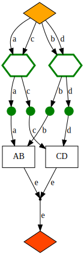
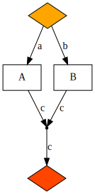
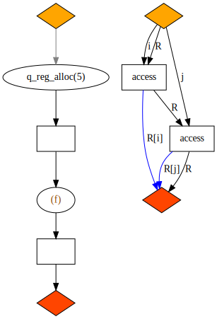
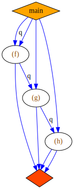

# QPR

QPR (Quantum Program Representation) is a proposed graph-based representation of
hybrid quantum–classical programs intended to be run in their entirety on a
real-time device.

This document describes the requirements, goals and design of QPR as an abstract
representation. It does not focus on concrete implementation, but rather aims
at a precise description of a data structure with clear semantics.

## Requirements

The representation must be rich enough to capture the behaviour of a program
that is specified as a sequence of classical, quantum or mixed operations
acting on finite data.

This is intended to cover the kinds of programs we are likely to want to run in
the real-time environment on H-series devices in the medium term.

In particular the following constructions are in scope:

- branches to other program locations conditional on classical values;
- function calls to defined subroutines;
- recursion.

For simplicity we assume a type system where every classical type has a fixed
finite set of possible values, and every quantum type has a fixed finite set of
basis values. (We could, without loss of generality, confine ourselves to bits
and qubits, but allowing more general types is convenient and doesn't much
affect the model.)

Thus we may identify a classical type with a finite set and a quantum type with
a finite-dimensional hilbert space.

Unbounded sequences, continuous variables, functions, graphs and other exotic
objects are out of scope for the type system.

(Remark: IEEE floating-point types could be included by the above, since they
have a finite number of possible values, but it may often be preferable to
replace them with coarser discrete types -- for example, expressing angles as
integer multiples of some fixed smallest angle makes hashing and equality
comparison easier. One motivation for the above restriction is to allow
effective hashing and comparison of literal values.)

We assume a set of built-in atomic operations, each with a fixed signature,
consisting of input and output classical and quantum types. In most cases the
input and output quantum types will be the same, but this is not a requirememt;
in particular we allow allocation and deallocation of qubits.

In addition there are "write" operations, which append some data to an output
tape. This data may be a fixed string or it may be computed from a classical
type.

The program has fixed entry and exit points. The entry point may have classical
and quantum inputs, provided by the user or a previous program. The contents of
the output tape are returned to the user on exit, or streamed during program
execution.

Runtime errors are possible. Likely causes are (classical or quantum) resource
exhaustion or invalid inputs to an atomic operation (such as division by zero).
In this case the program aborts with an indication of failure.

## Example program (as pseudocode)

The following pseudocode should be amenable to capture by the model. This
example includes most of the functionality covered by the requirements above.

```python
# Subroutine
def f(q0: Qubit, q1: Qubit) -> Bit:  # q0, q1 are implicitly returned
    H(q0)
    H(q1)
    q = Qubit()  # Qubit allocation in zero state (may raise runtime error)
    CCX(q0, q1, q)
    H(q)
    CCZ(q0, q1, q)
    del q  # Qubit deallocation (would happen anyway on function exit)
    c0, c1 = Measure(q0), Measure(q1)  # Non-destructive measurement
    c = c0 ^ c1
    if c == 1:
        T(q1)
        return f(q0, q1)  # Recursion
    else:
        return c0


# Record a bit value
def write_bit(c: Bit) -> None:
    if c == 0:
        write("0\n")  # Write bytes to the output tape
    else:
        write("1\n")


# Main program, takes an integer input
def main(n: u32) -> None:
    if n == 0:
        write("Error\n")
        return
    q0, q1 = Qubit(), Qubit()  # Allocate two qubits
    while n != 1:
        CZ(q0, q1)
        if n % 2 == 0:
            n = n / 2
            c = f(q0, q1)
            write_bit(c)
        else:
            if n >= 1431655765:
                write("Overflow\n")
                return
            n = (3 * n + 1) / 2
            c = f(q1, q0)
            write_bit(c)
    write("Done\n")
```

## Goals

- The representation should be graph-based.
- It should be easy to convert to and from QIR (for profiles within the scope
  outlined above).
- It should be suitable for implementation as a TKET2 IR. In particular, it
  should enable the kinds of program optimizations we want TKET2 to make.
- It should be compatible with the Grand Graph Unification -- in the sense that
  it could use any implementation of that as its underlying graph
  implementation.

## Design

### Types

There are a number of defined classical and quantum data types, such as `Bit`,
`Qubit` etc. The type system is extensible. A classical type is just a name for
the (finite) set of values it may take, and a quantum type is just a name for
the (finite-dimensional) Hilbert space describing its state.

Among the types is the `Unit` type, which has only one possible value, so
carries no information but is useful for expressing order, for example between
write operations.

The following are not data types (attached to wires), but are used for
book-keeping (e.g. specifying parts of the graph or output data). For example,
`NodeId` and `FnId` could be implemented as integers; while `Output` could be
implemented as ASCII or byte strings.

- `Output` (a string of data to be appended to the output tape)
- `FnId` (a unique function identifier)
- `NodeId` (a unique node identifier)

Data types _may_ have:

- default values or states (necessary for initialization on allocation);
- specified mappings to `Output` (for classical types, necessary for direct
  output of values).

### Signatures

A _signature_ is a map from (string) names to types. For example, the input
signature of a non-destructive measurement operation could be something like

```python
{"q_in": Qubit}
```

while the output signature could be

```python
{"q_out": Qubit, "result": Bit}
```

### F-nodes

An _F-node_ (F for "functional") is an operation with:

- a fixed input signature;
- a fixed output signature;
- a unique specifier (specifying the functionality, e.g. `CX` or `myfunc`);
- optionally, a `NodeId` (identifying the instance).

Predefined F-node types may include, for example:

- a CX gate (two `Qubit` wires in, two `Qubit` wires out);
- a non-destructive measurement (one `Qubit` wire in, one `Qubit` and one `Bit`
  wire out);
- a destructive measurement (one `Qubit` wire in, one `Bit` wire out);
- a 32-bit integer addition gate (two `i32` wires in, one `i32` wire out);
- a bit copy (one `Bit` wire in, two `Bit` wires out);
- a qubit allocation (no wires in, one `Qubit` wire out);

and so on.

We can define a generic copy operation for classical types, and generic
allocation and deallocation operations for all types having a default.

The set of predefined F-node types _must_ include:

- `write` nodes: these write a given `Output` string to the output tape. If they
  write a literal they have a `Unit` input wire; if they write a classical
  value (with a defined map to `Output`) they have an input wire of that type.
  They have a `Unit` output wire.
- `call` nodes: these call a _function_ (see below), given:
    - the function's `FnId`;
    - a type-matching bijection from node input names to function input names;
    - a type-matching bijection from function output names to node output
      names.

These allow for writing of output, and user-defined functions, respectively.

### D-nodes

A _D-node_ (D for "decision") is an instruction with:

- a fixed input signature;
- a function mapping the classical input values to:
  - a `NodeId` (identifying the target node);
  - a type-matching injective mapping from input names of the target node to
    input names of the D-node.

Decision nodes are used to implement control flow.

### C-nodes

A _C-node_ (C for "choice") is an _F-node_ node that succeeds a D-node. It is a
no-op, so its input and output signatures are the same. It serves to channel a
chosen subset of the input data of the preceding D-node.

### FD-graphs

An _FD-graph_ is a directed graph composed of F-nodes and D-nodes, connected
by _data edges_.

Data edges have associated types that match the types of their source and target
ports.

Note that a for each type in a node's inout signature, there may be several
edges (coming from different predecessor nodes) that match it.

### Functions

A _function_ is a named FD-graph with a distinguished _initial_ F-node having no
input wires and a distinguished _final_ F-node having no output wires. The
input signature of the function is defined to be the output signature of its
initial node, and the output signature of the function is defined to be the
input signature of its final node.

This definition avoids the need for dangling edges in the graph.

### Libraries and programs

A _library_ is a union of uniquely named functions. A _program_ is a library
with a distinguished function (called `main`).

### Computational model

The computational model for a program expressed as an FD-graph is as follows:

- Every node has certain fixed input wires, which "fire" when they receive
  input.
- When all input ports have received a firing input wire, the node may
  "execute", i.e. perform its operation (in the case of an F-node) or decision
  (in the case of a D-node). It then switches its input wires to the waiting
  state, waits for all its output wires to be in the waiting state, and then
  fires the necessary output wires (all of them in the case of an F-node, just
  the chosen ones leading to the chosen C-node in the case of a D-node).
- At program start, all wires are in a waiting state and the main function's
  input node is executed, outputting the program's input. (If there is no
  input, there will be a `Unit` wire which is fired.)
- It is not necessary that a node execute as soon as it has all its inputs. For
  example, allocation nodes, which have no inputs, _may_ execute at any time,
  but in practice might only do so when they are blocking the successor node
  from executing _and_ the necessary resources for allocation are available.
- When all the input wires of the main function's final node have fired, the
  program exits.

## Example program (as FD-graph)

Below is an FD-graph corresponding to the example pseudocode above.

Black arrows are used for classical data, blue for quantum. Grey arrows are used
for the `Unit` type. D-nodes are shown as green hexagons; C-nodes as green
circles; all other nodes are F-nodes. Call nodes are ellipses; write nodes are
right-pointing arrows. Initial and final nodes are diamonds. Allocation and
deallocation nodes are circles.

The picture does not show all of the information from the FD-graph – such as
port labels and exact types – but shows all the nodes and edges of the graph.


## Evaluation

Let's see to what extent this graph representation meets the goals stated
above.

There are three main questions to be answered:

- _Coherence_. Is it easy to translate from, say, QIR to this representation,
   and back, so that it unambiguously captures the semantics of any program we
   might want to run?
- _Utility_. Does it facilitate the kinds of optimizations we want to be able to
   perform with TKET2?
- _Unity_. Does it fit naturally within the GGU project? (In particular, can it
   easily use the same underlying graph library?)

### Coherence

It is mostly straightforward to translate QIR to this representation. However,
there may be some cases where it is not: I discuss the question of how to
handle arrays and references below.

There is a minor issue with the ordering of write operations. Branching from
F-nodes, although it does not introduce any ambiguity in the data, allows
operations to be done in various orders. Consider this simple program
(no inputs, no outputs, uses the `write_bit` function from our last example):


Here the writes could happen in either order, whereas QIR will insist on one
order or the other. There are two ways round this:

- insert a `Unit` arrow from the write we want to happen first to the other
  write, to enforce the order; or
- include enough information in the writes that the output tape can be
  post-processed to reconstruct the corresponding QIR output.

Either approach would be acceptable. Something like the latter would probably be
necessary anyway, since QIR doesn't have quite the same output model (it has
various
"output schemas"), but doing the former may make the post-processing easier.

There are two more serious concerns, _hangs_ and _races_, which can be easily
illustrated.

_Hangs_. Consider this FD-graph:



Input data is split in two directions, each of which triggers a decision. If the
decision on the left is to take the "a" branch and the decision on the right is
to take the "d" branch, then neither "AB" nor "CD" will ever receive a full
complement of input and the program will hang.

This is a problem of dominance: each of the D-nodes dominates the final node,
but only one can be executed.

We can argue that this is simply a badly-constructed program, for the above
reason, which would never arise from valid QIR. However, it highlights the fact
that even a DAG may not terminate when there is control flow, and conversion of
an FD-graph to (e.g.) QIR probably needs to begin with an analysis of the
dominance graph.

_Races_. Comsiser this FD-graph:



Again the input data is split in two directions. This time there are no
decisions, but there is a "join" node which could receive data from either "A"
or "B", and there is no guarantee as to which.

Here the problem is that data joins from two paths both of which may be
executed. Again, this would not arise from valid QIR. Note, however, that
the _valid_ FD-graph for the function `f` above also has a similar join, coming
from two _exclusive_ control-flow branches.

### Utility

Convex subgraphs of an FD-graph that contain only F-nodes may be treated as
basic blocks, and are amenable to TKET-style circuit optimization. These basic
blocks are connected by the D-nodes and their associated C-nodes into a
control-flow graph, which may be amenable to other optimizations. This
factoring of the graph is likely to be useful. We may also be interested in
applying optimizations to purely-classical regions (including both kinds of
node), perhaps by going to and from LLVM and using standard passes. This
suggests a three-step approach:

1. Identify maximal purely-classical regions of the graph; convert them to LLVM;
   optimize; convert back and substitute.
2. Identify maximal F-node-only regions of the graph; optimize these using TKET
   passes.
3. Apply CFG-level optimizations (a well-studied problem).

The ability for D-nodes to be "hidden" inside F-nodes via function calls
(for example, the function `f` above contains D-nodes but can be called as an
F-node) opens the door to higher-level custom optimizations but also begs the
question of how we can annotate user-defined functions with information such as
commutativity or parallelizability (discussed below).

If we can implement user-defined pattern-matching passes on TKET2 graphs then
they should be applicable here too; thus we can accommodate user-defined passes
spanning control flow.

Opportunities for parallelism emerge naturally from the graph structure, since
it expresses the data dependencies. Since parallelized operations may require
qubit allocation (and deallocation), the compiler will need to account for the
resource requirements of each function when deciding whether or not to
parallelize. These resource requirements are easily deduced from the function's
graph. Desired space–time trade-offs and resource limits could be incorporated
into the compilation process.

An advantage of this representation that is specific to ion-trap devices: when
compiling, we can try to design functions so that they can potentially operate
on qubits within a single zone: this may be a useful hint to the ion transport
algorithm.

### Unity

The question here has two sides:

- Could this design be easily implemented using the proposed GGU framework?
- Does it make effective use of the features of the GGU framework?

The GGU design is work in progress. The proposal states that "at the heart of
this project are hierarchical port hypergraphs", and goes on to highlight four
important features: ports, hyperedges, hierarchy, and nonsequentiality.

#### Ports

It is possible to represent an FD-graph as a portgraph, provided we are willing
to accept the multiplication of the output ports of D-nodes. Specifically, if a
D-node has $n$ possible successor C-nodes, with signatures $S_i$
( $0 \leq i < n$ ), then the outgoing ports of the D-node are the disjoint union
$\bigcup_{0 \leq i < n} S_i$.

It's debatable whether this is a hack or a useful application of the portgraph
idea. To make it work with the computational model described above, it is
necessary that some of the output ports do not fire after the "operation"
(in this case, decision) is executed. One could think of data carried along
these wires as "optional".

#### Hyperedges

From my reading of the GGU proposal, the reason for hyperedges is to allow
exactly the kinds of branches that D-nodes allow, but expressed in a slightly
different way: a single hyperedge would connect an output port to all its
possible destination ports. If that interpretation is correct then I think the
difference is mainly one of interpretation.

#### Hierarchy

There is no intrinsic hierarchy in this structure: nodes cannot be graphs,
although call nodes to some extent fulfil this function by containing
references to graphs.

If we did inline these function calls we would end up with a hierarchy, but
there are good reasons not to: avoiding blow-up of the graph size, allowing
recursive function calls, and in principle allowing annotations of functions
for purposes of optimization. For defining a runtime program, having a library
of functions seems a better solution.

#### Nonsequentiality

Nonsequentiality is built into the FD-graph model. The computational model
described above imposes no ordering on the operations beyond the requirements
of the data flow.

## Open questions

### Arrays and references

It is legitimate in QIR to alllocate an array of qubits and access them via a
non-constant variable. How would we represent these arrays (registers) in the
graph, and how can we express code like

```python
def f(q_array):
    # q_array is an array of 20 qubits
    for i in range(10):
        CX(q_array[2 * i], q_array[2 * i + 1])
```

in a way that makes parallelization transparent, without having to unroll the
loop? If we assume some sort of classical register type for `q_array` then we
would naturally envisage operations like



where the access operation is occurring inside `f`. This raises questions like:

- Is it enough to make a register non-copyable, and does this lose us anything?
- Do we need a distinction between "const" and non-"const" registers?
- What is the type of resource returned by the access function? `Qubit` or
  reference-to-`Qubit`? If `Qubit`, how do we prevent a later access from
  returning the same `Qubit` (violating non-copyability)? Some sort of
  reference type seems unavoidable. Again, "const" or non-"const"?
- If it is a reference, do we need a "dereference" operation before passing it
  into "CX", and how does this work?
- Does the convenient mental model of qubits being physically moved around the
  graph (like ions) have to be abandoned, with references floating around?

### Annotations

Other annotations could be useful when it comes to compiling for specific
devices. For example, if `f`, `g` and `h` are three mutually commuting
operations with some data dependency (e.g. a shared control qubit), can we tell
the compiler that it is free to reorder them (to minimize ion transport, for
example)?



### Characterization of well-formed graphs

Is there a nice way to characterize FD-graphs that avoid the "hangs" and "races"
problems highlighted above? This is probably closely related to the problem of
translating the FD-graph to valid QIR.

## A simplification

The execution model as described above suggests a framework that is both simpler
and more general than FD-graphs, and may repay further consideration.

Our new directed graph has only one type of node, which acts as either an F-node
or a D-node or combines the two. There is a distinguished initial node with no
inputs and a distinguished final node with no outputs. Every edge has a type.
During execution, edges may be firing or waiting. Initially, all edges are
waiting except for the output edges of the initial node, which fire with the
input data.

Each node is an automaton, or worker. When all its input wires are firing _and_
all its output wires are waiting, it executes. Execution ends with _some subset
of_ its output wires being fired with computed data. Both the computed data and
its destination wires are part of the computation. It then puts all its input
wires back into the waiting state.

When the final node executes, the program ends.

One thing we _lose_ in this simplification is being able to see from the graph
exactly which sets of output wires can fire on each node execution. This
information would instead be implicit in the definitions of the nodes'
functionality, and could of course be captured as annotations.

## Conclusions

The design together with its computational model appears to be a coherent and
correct representation of runtime programs and to be convertible to and from
other representations such as QIR. It facilitates optimizations. It seems
consistent with the Grand Graph Unification proposal (though that is still a
work in progress).

As next steps I propose:

- migrating to the simpler model outlined above, unless there is some problem
  with it;
- implementation of the data structure in code, together with an execution
  engine (simulator);
- expressing well-formedness (avoidance of the aforementioned hang and race
  problems) as graph properties;
- implementation of a translation from this structure to (perhaps a simplified
  version of) QIR;
- addressing the other open questions above (limits of expressivity;
  annotations);
- further investigation of optimization strategies.
