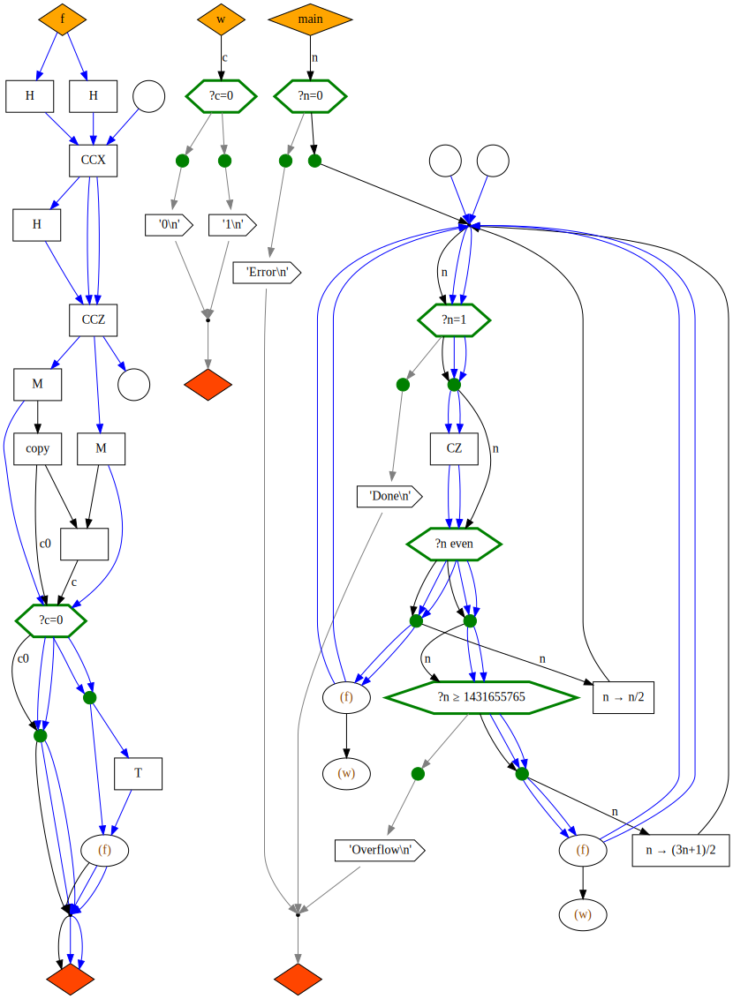
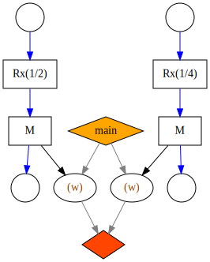

# QPR

QPR (Quantum Program Representation) is a proposed graph-based representation of
hybrid quantum–classical programs intended to be run in their entirety on a
real-time device.

This document describes the requirements, goals and design of QPR as an abstract
representation. It does not discuss concrete implementation, but rather aims at
a precise description of a data structure with clear semantics.

## Requirements

The representation musy be rich enough to capture the behaviour of a program
that is specified as a sequence of classical, quantum or mixed operations acting
on finite data.

This is intended to cover the kinds of programs we are likely to want to run in
the real-time environment on H-series devices in the medium term.

In scope:

- branches to other program locations conditional on classical values;
- function calls to defined subroutines;
- recursion.

Every classical type has a fixed finite set of possible values, and every
quantum type has a fixed finite set of basis values. (We could, without loss of
generality, confine ourselves to bits and qubits, but allowing more general
types is convenient and doesn't much affect the model.)

(Out of scope for the type system: unbounded sequences, continuous variables,
functions, graphs or other exotic objects.)

(Remark: IEEE floating-point types could be included by the above, since they
have a finite number of possible values, but it may often be preferable to
replace them with coarser discrete types -- for example, expressing angles as
integer multiples of some fixed smallest angle makes hashing and equality
comparison easier.)

Thse we may identify a classical type with a finite set and a quantum type with
a finite-dimensional hilbert space.

Every atomic operation has a fixed signature, consisting of:

- a finite sequence of input classical types;
- a finite sequence of output classical types;
- a finite sequence of quantum types (which are both input and output).

Thus quantum data is neither created nor destroyed by operations. We do allow
allocation and deallocation of qubits (outside operations).

In addition there are "write" operations, which append a sequence of bytes
(computed from a piece of classical data) to an output tape.

The program has fixed entry and exit points. The entry point may have classical
and quantum inputs, provided by the user or a previous program, and the exit
point may have classical and quantum outputs. On exit, the contents of the
output tape are returned to the user.

## Example program (as pseudocode)

The following pseudocode should be amenable to capture by the model. This
example includes most of the functionality covered by the requirements.

```python
# Subroutine
def f(q0: Qubit, q1: Qubit) -> Bit:  # q0, q1 are implicitly returned
    H(q0)
    H(q1)
    q = Qubit()  # Qubit allocation in zero state (may raise runtime error)
    CCX(q0, q1, q)
    H(q)
    CCZ(q0, q1, q)
    del q  # Qubit deallocation (would happen anyway on function exit)
    c0, c1 = Measure(q0), Measure(q1)  # Non-destructive measurement
    c = c0 ^ c1
    if c == 1:
        T(q1)
        return f(q0, q1)  # Recursion
    else:
        return c0


# Record a bit value
def write_bit(c: Bit) -> None:
    if c == 0:
        write(b"0\n")  # Write bytes to the output tape
    else:
        write(b"1\n")


# Main program, takes an integer input
def main(n: u32) -> None:
    if n == 0:
        write(b"Error\n")
        return
    q0, q1 = Qubit(), Qubit()  # Allocate two qubits
    while n != 1:
        CZ(q0, q1)
        if n % 2 == 0:
            n = n / 2
            c = f(q0, q1)
            write_bit(c)
        else:
            if n >= 1431655765:
                write(b"Overflow\n")
                return
            n = (3 * n + 1) / 2
            c = f(q1, q0)
            write_bit(c)
    write(b"Done\n")
```

## Goals

- The representation should be graph-based.
- It should be easy to convert QIR (for profiles within the scope outlined
  above).
- It should be suitable for implementation as a TKET2 IR. In particular, it
  should enable the kinds of program optimizations we want TKET2 to make.
- It should be compatible with the Grand Graph Unification -- in the sense that
  it could use any implementation of that as its underlying graph
  implementation.

## Design

### Types

There are a number of defined classical and quantum data types, such as `Bit`,
`Qubit` etc. The type system is extensible. A classical type is just a name for
the (finite) set of values it may take, and a quantum type is just a name for
the (finite-dimensional) Hilbert space describing its state.

Among the types is the `Unit` type, which has only one possible value, so
carries no information but is useful for expressing order, for example between
write operations.

The following are not data types (attached to wires), but are used for
book-keeping (e.g. specifying parts of the graph or output data). For example,
`NodeId` and `FnId` could be implemented as integers; while `Output` could be
implemented as ASCII or byte strings.

- `Output` (a string of data to be appended to the output tape)
- `FnId` (a unique function identifier)
- `NodeId` (a unique node identifier)

### Signatures

A _signature_ is a map from (string) names to types.

### F-nodes

An _F-node_ (F for "functional") is an operation with:

- a fixed input signature;
- a fixed output signature;
- a unique specifier (specifying the functionality);
- optionally, a `NodeId` (identifying the instance).

Predefined F-node types may include, for example:

- a CX gate (two `Qubit` wires in, two `Qubit` wires out);
- a non-destructive measurement gate (one `Qubit` wire in, one `Qubit` and one
  `Bit` wire out);
- an integer addition gate (two `u32` wires in, one `u32` wire out);
- a bit copy (one `Bit` wire in, two `Bit` wires out);
- a qubit allocation (no wires in, one `Qubit` wire out);

and so on. Note that in the last example above we must specify the initial state
of the `Qubit`. We could also define specifiers for generic classical copy
operations, generic initialization, etc (i.e. the specifier may include more
imformation than just a name).

Predefined F-node types _must_ include:

- `write` nodes: these write a given `Output` string to the output tape. They
  have one `Unit` input wire and one `Unit` output wire.
- `call` nodes: these call a _function_ (see below), given:
    - the functions `FnId`;
    - a type-matching bijection from node input names to function input names;
    - a type-matching bijection from function output names to node output names.

These allow for writing of output, and user-defined functions, respectively.

### D-nodes

A _D-node_ (D for "decision") is an instruction with:

- a fixed input signature;
- a function mapping the classical input values to:
  - a `NodeId` (identifying the target node);
  - a type-matching injective mapping from input names of the target node to
    input names of the D-node.

### FD-graphs

An _FD-graph_ is a directed graph with two kinds of node (F-nodes and D-nodes)
and two kinds of edge: _data edges_ and _control edges_.

Data edges are either dangling (input or output) edges or type-matching edges
from F-node to F-node or from F-node to G-node. 

Control edges go from D-nodes to possible target F-nodes.

### Functions

A _function_ is a named FD-graph with a distinguished "initial" F-node and a
distinguished "final" F-node, such that there are no dangling input edges to
F-nodes except into the initial node and no dangling output edges except from
the output node. The input signature of the function is the input signature of
its initial node and the output signature is the output signature of its final
node.

### Libraries and programs

A _library_ is a union of uniquely named functions. A _program_ is a
library with a distinguished function (called `main`).

## Example program (as FD-graph)

Below is an FD-graph corresponding to the example pseudocode above.

Black arrows are used for classical data, blue for quantum. Grey arrows are used
for the `Unit` type. D-nodes are shown as green hexagons (with green choice
points below); all other nodes are F-nodes. Call nodes are ellipses; write nodes
are right-pointing arrows. Initial and final nodes are diamonds. Allocation and
deallocation nodes are circles.

It is missing some of the information from the FD-graph, such as port labels,
and exact types, but shows all the nodes and arrows.



## Evaluation

Let's see to what extent this graph representation meets the goals stated above.

There are three main questions to be answered:

- _Coherence_. Is it easy to translate from, say, QIR to this representation,
   and back, so that it unambiguously captures the semantics of any program we
   might want to run?
- _Utility_. Does it facilitate the kinds of optimizations we want to be able to
   perform with TKET2?
- _Unity_. Does it fit naturally within the GGU project? (In particular, can it
   easily use the same underlying graph library?)

### Coherence

The computational model for the FD-graph can be expressed as follows:

- Every node has certain fixed input wires, which "fire" when they receive
  input. When all input wires have fired, they may perform their operation (in the
  case of an F-node) or decision (in the case of a D-node) and fire the
  corresponding output nodes, switching all input wires back to the "waiting"
  state.
- At program start, all wires are waiting and the input wires of the main
  function's input node are fired with the program input.
- It is not necessary that a node fire as soon as it has all its inputs (for
  example, allocation nodes are free to fire at any time, but in practice would
  only do so when they are blocking the successor node from firing).
- When all the input wires of the main function's final node have fired, the
  program exits.

It is, I believe, straightforward to translate QIR to this representation and vice versa;
the question is whether the computational models match up. The only sticking
point is that the graph model may introduce ambiguities in the order of operations.

There are two possibilities to consider here: branching from F-nodes and from
D-nodes.

Branching from F-nodes allows operations to be done in various orders, but does
not introduce any ambiguity in the data. It can make the order of writes ambiguous,
however. Consider this simple program (no inputs, no outputs, uses the
`write_bit` function from our last example):



The writes could happen in either order; whereas QIR will insist on one order or
the other. There are two ways round this:

- insert a `Unit` arrow from the write we want to happen first to the other write,
  to enforce the order; or
- include enough information in the writes that the output tape can be post-processed
  to reconstruct the corresponding QIR output.

Either approach would be acceptable. Something like the latter would probably be
necessary anyway, since QIR doesn't have quite the same output model, but doing
the former may make the post-processing easier.

Branching from D-nodes does not introduce any parallelism in program execution
since only one branch is followed.

Therefore I believe that the FD-graph provides a coherent model of program execution.

### Utility

Convex subgraphs of an FD-graph that contain only F-nodes may be treated as basic
blocks, and are amenable to TKET-style circuit optimization. These basic blocks
are connected by the D-nodes into a control-flow graph, which may be amenable to
other optimizations. This factoring of the graph may be helpful. We may also be
interested in applying optimizations to purely-classical regions (including both
kinds of node), perhaps by going to and from LLVM and using standard passes. This
suggests a three-step approach:

1. Identify maximal purely-classical regions of the graph; convert them to LLVM;
   optimize; convert back and substitute.
2. Identify maximal D-node-free regions of the graph; optimize these using TKET.
3. Apply CFG-level optimizations.

The ability for D-nodes to be "hidden" inside F-nodes via function calls (e.g. the
function `f` above contains D-nodes but can be called as an F-node) opens the
door to higher-level custom optimizations.

When we start to implement user-defined pattern-matching passes on TKET2 graphs,
they should be applicable here too.

### Unity

The question here has two aspects:

- Could this design be easily implemented using the proposed GGU framework?
- Does it make effective use of the features of the GGU framework?

Quoting from the GGU proposal: "I propose that at the heart of this project are
hierarchical port hypergraphs."

The "knotty" part of the implementation would be in the D-nodes. Unlike F-nodes
these don't have a fixed but a variable output signature, depending on the target.
In the illustration above I used subsidiary green circles to "channel" the output
from the D-nodes, but this was just for visual clarity; they need not exist as separate
nodes in the graph.

Note that there is no intrinsic hierarchy in this structure: nodes cannot be
graphs, although call nodes to some extent fulfil this function by containing
references to graphs.
